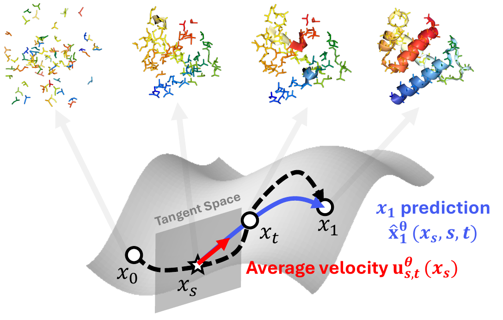
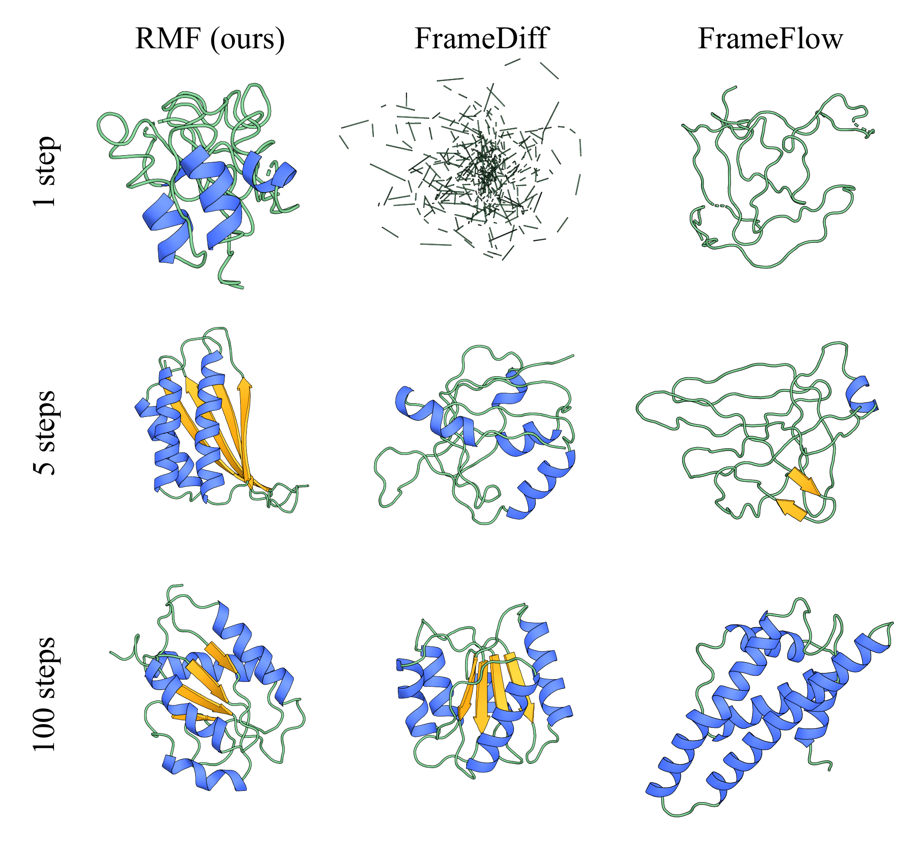

# 🧬 Protein Frame RMF
[](https://arxiv.org/abs/2602.07744)



This repository provides **protein-backbone experiments** for **Riemannian MeanFlow (RMF)**, a few-step flow-map framework for generative modeling on Riemannian manifolds. RMF learns average-velocity flow maps on the manifold and is designed for fast, stable training and sampling in high dimensions.

RMF builds on a **semigroup Riemannian MeanFlow objective**, **x₁-prediction** of manifold-valued endpoints for few-step sampling, and **stabilization techniques** for high-dimensional manifolds. The approach supports reward-guided design on protein backbones.



*Example protein backbone samples from the RMF model.*

## 📦 Environment setup

Use the provided Conda environment (FrameFlow-style):

```bash
conda env create -f fm.yml
conda activate fm

# Optional: match torch-scatter to your CUDA/PyTorch version
pip install torch-scatter -f https://data.pyg.org/whl/torch-2.0.0+cu117.html

pip install torch-ema scikit-learn
pip install -e .
```

If you notice missing dependencies or have setup suggestions, please open an issue or pull request.

## 📁 Data preparation

Preprocessed SCOPe protein backbone data is on [Zenodo](https://zenodo.org/records/12776473) (see the FrameFlow project page for the latest link). Download and unpack the archive in the **repository root** so that `processed_scope/` is at the top level:

```bash
tar -xzvf preprocessed_scope.tar.gz
```

Expected layout (data loader expects `processed_scope/` at the root):

```
├── analysis
├── configs
├── data
├── experiments
├── media
├── models
├── openfold
├── processed_scope
└── protein_rewards
```

**Config:** The default dataset is SCOPe. Training configs (e.g. [`configs/semi_mf.yaml`](configs/semi_mf.yaml)) use `data: scope`, which loads [`configs/data/scope.yaml`](configs/data/scope.yaml). That file sets task/dataset and DataLoader/sampler options; [`configs/data/datasets.yaml`](configs/data/datasets.yaml) (included by scope.yaml) defines the dataset (metadata CSV path, filtering, and evaluation split). Implementation: `data/datasets.py`, `data/protein_dataloader.py`.

## ⬇️ Model weight downloads

Pretrained RMF checkpoints are hosted on [Zenodo](https://zenodo.org/records/18582218). Download `weights.tar.gz`, then unpack it in the **repository root** so that a `weights/` directory is created:

```bash
tar -xzvf weights.tar.gz
```

After unpacking, `weights/` will contain checkpoint directories for the three model sizes: **RMF_S**, **RMF_M**, and **RMF_L**. Point your inference config’s `ckpt_path` to the appropriate checkpoint file inside the desired directory (e.g. `weights/RMF_M/your_checkpoint.ckpt`).

## 🚀 Run

### Training

Entrypoint: `experiments/train_se3_splitmeanflow.py` (default config: [`configs/semi_mf.yaml`](configs/semi_mf.yaml)). Example for a single node with 4 GPUs:

```bash
python experiments/train_se3_splitmeanflow.py \
  model=AdaLN_S \
  experiment.num_devices=4 \
  experiment.trainer.accumulate_grad_batches=1
```

You can set `model=AdaLN_S`, `AdaLN_M`, or `AdaLN_L` to choose size: **AdaLN_S** (small, fast), **AdaLN_M** (~92M parameters), **AdaLN_L** (~437M parameters). The architecture uses an invariant point attention trunk with Riemannian MeanFlow objectives and x₁-prediction on SE(3) frames. For more options (semigroup loss, time sampler, loss weights), see `configs/semi_mf.yaml` and `configs/base_experiment.yaml`.

### Inference (basic)

Run inference with `experiments/inference_se3_flowmaps.py` and the config [`configs/inference/flowmap_inference.yaml`](configs/inference/flowmap_inference.yaml). Set `ckpt_path` to your trained checkpoint and `output_dir` to where PDBs and optional trajectories should be written. Use `n_steps`, `do_ddim`, and `do_integration` to control the number of steps and integration scheme (e.g. 1, 5, 10, or 100 steps). Then run:

```bash
python experiments/inference_se3_flowmaps.py
```

The script loads the RMF model from `ckpt_path`, generates protein backbone samples for the lengths specified under `samples.*`, and saves PDB files (and optionally intermediate SE(3) trajectories) under `output_dir`.

### Inference (reward-guided)

The same script supports reward-guided sampling. Enable it with `do_reward_guidance` and configure `reward_config` in the inference config. Example configs are [`configs/inference/reward_guidance_ss.yaml`](configs/inference/reward_guidance_ss.yaml) (secondary-structure composition) and [`configs/inference/reward_guidance_motif.yaml`](configs/inference/reward_guidance_motif.yaml) (motif RMSD). Set `ckpt_path` and the reward fields (e.g. `alpha_weight`, `beta_weight` for SS, or `target_pdb`, `motif_position` for motif guidance), then run `python experiments/inference_se3_flowmaps.py` as above. RMF’s few-step flow maps allow reward look-ahead by evaluating rewards on predicted terminal states, which improves guidance efficiency for protein design.

## 📄 Citation

If you use this code in your research, please cite:

```bibtex
@misc{woo2026riemannianmeanflow,
      title={Riemannian MeanFlow}, 
      author={Dongyeop Woo and Marta Skreta and Seonghyun Park and Sungsoo Ahn and Kirill Neklyudov},
      year={2026},
      eprint={2602.07744},
      archivePrefix={arXiv},
      primaryClass={cs.LG},
      url={https://arxiv.org/abs/2602.07744}, 
}
```